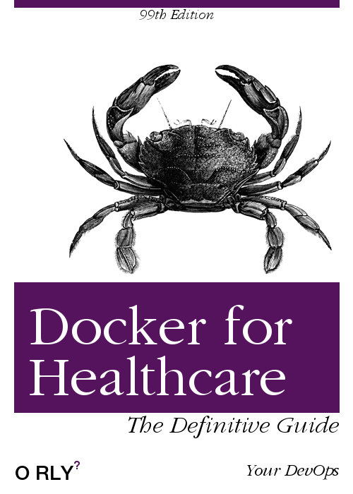
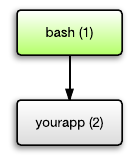

class: center, middle, first

<div class="first-page__header">
  
  <p class="first-page__caption">Software Engineering Services</p>
</div>

# Docker Under Microscope

<div class="first-page__footer">
  
</div>

---
class: author-slide

<div class="author">
  <div class="info-box">
    <div class="name">
      Hi there. <br /> I'm Alexey Cherkashin
    </div>
    <div class="info">
      <div class="row">
        Technologies: Ruby, React, Docker
      </div>
    </div>
  </div>
</div>

<div class="contact-info">
  <div class="info-box">
    <div class="contact-header">
      Contact Information:
    </div>
    <div class="contact-data">
      <div class="row">
        Phone: +375 29 39 53 194
      </div>
      <div class="row">
        Email: aleksei.cherkashin@itechart-group.com
      </div>
      <div class="row">
        Skype: goodniceweb
      </div>
    </div>
  </div>
</div>

???

WHY ME?

Watch Docker from (end of) 2014

It was 1.4 that time

NEXT

---
layout: true

<div class="regular-page__background">
  
</div>

---
class: center, middle


???

## 1.13.1 => 17.03

## Changed versioning approach

## now: 18.09

Starting with this release, Docker is on a monthly release cycle and uses a new YY.MM versioning scheme to reflect this. Two channels are available: monthly and quarterly. Any given monthly release will only receive security and bugfixes until the next monthly release is available. Quarterly releases receive security and bugfixes for 4 months after initial release. This release includes bugfixes for 1.13.1 but there are no major feature additions and the API version stays the same. Upgrading from Docker 1.13.1 to 17.03.0 is expected to be simple and low-risk


NEXT

---
class: center, middle


???

Зрелый, состоявшийся продукт. Сами убедитесь

---

# Agenda

???

## Кто уже использует Docker активно на проекте?

## Кто запускал локально, для себя, что-то делал чуть-чуть?

## Кому еще не удалось попробовать Docker?

---

# Agenda

1. What is Docker and How it Works?

---

# Agenda

1. What is Docker and How it Works?
2. Use Cases

---

# Agenda

1. What is Docker and How it Works?
2. Use Cases
3. Pros and Cons

---

# Agenda

<ol start="4">
  <li>Best Practices</li>
</ol>

---

# Agenda

<ol start="4">
  <li>Best Practices</li>
  <li>Top 7 Tips and Tricks</li>
</ol>

---
class: center

# What is Docker?


???

Docker - это OpenSource проект для автоматизации запуска и деплоя приложений
через контейнеры. С помощью Docker вы можете отделить ваше приложение
от вашей инфраструктуры и обращаться с инфраструктурой как управляемым приложением. 

Как это достигается?

* image
  - layers
  - Dockerfile
  - tag
* container
* volume
* network
* cli
* compose
* swarm
* hub (registry)

Но начнем с самого простого: на что Docker похож?

---
class: center

# Docker vs Virtual Machine


???

Who have ever ever used:
- VirtualBox
- Vagrant
- other?

Что самое тяжеловесное в создании новой виртуалки?
OS!

В некотором смысле Docker немного похож на виртуальную машину. Но в отличие
от виртуальной машины, вместо создания виртуальной операционной системы,
Docker использует то же ядро Linux, что и система, на которой он установлен.

Что это дает? Помимо того, что это позволяет сохранить место на жестком диске,
контейнеры также стартуют быстрее, используют меньше памяти и процессорного времени,
чем виртуальные машины.

---
class: center

# How it Works?


???

Как видим сначала идёт линукс ядро. Оно общее для всех контейнеров. Так как
взаимодействие с ним необходимо только для чтения.

Далее идут images. Есть
- base
- parent
Что это такое? Когда переводил, подумал, что образ - не совсем
передает мысль об их архитектуре. Ведь образ - это что-то цельное.
Docker image - тоже цельный. Но он строится на слоях, layers.

Тут хорошо видно.
Ораньжевый - base image, busybox. Мало полезного.
Голубой - parent image. Есть несколько дополнительных слоев, для подготовки
к запуску приложения.

Base or parent: postgres:9.4, ubuntu:18.04

---
class: center

# How it Works?


???

У каждого слоя есть ссылка на предыдущий. Чтобы сохранять последовательность.
Слои в images - read-only сущности. Вы не можете изменить уже существующий слой.
Только наложить следующий. Это может быть другой read-only слой, созданый через
директиву в Dockerfile. А может быть read-write слой, то есть, ваш контейнер.

---

# Use Cases

---

# Use Cases

1. Simplifying Configuration

---

# Use Cases

1. Simplifying Configuration
2. App Isolation

---

# Use Cases

1. Simplifying Configuration
2. App Isolation
3. Rapid Deployment

???

Было бы несправедливо сказать о use cases, и не упомянуть как сам использую его.

NEXT

---
class: center, middle



???

For development - all dependencies are Docker containers

For running tests in Elixir service

Итак, мы поговорили о том, что такое докер и что он нам дает.
Давайте потренируемся создавать свой собственный image.

---
class: s-code

# Let's create our own image!

```Dockerfile
FROM ubuntu:18.04

RUN mkdir /workdir
WORKDIR /workdir
COPY script.sh .
ENV NAME Greg

ENTRYPOINT ["/bin/bash", "./script.sh"]
```

---

# Always start with FROM

```Dockerfile
FROM ubuntu:18.04

# RUN mkdir /workdir
# ...
```

---

# Prepare image

```Dockerfile
# FROM ubuntu:18.04

RUN mkdir /workdir

# ... 
```

---

# Change you current active directory

```Dockerfile
# RUN mkdir /workdir

WORKDIR /workdir

# ... 
```

---

# You might need some files

```Dockerfile
# WORKDIR /workdir

COPY script.sh /workdir

# ... 
```

???

Есть еще ADD.

Позже посмотрим чем отличаются COPY and ADD

---

# File content

```sh
echo "Hello ${NAME}! \
  My name is `hostname`. \
  I'm in `pwd`"
```

---

# Setup ENV variables

```Dockerfile
# COPY /workdir

ENV NAME Greg

# ... 
```

---

# Define what is executable

```Dockerfile
# ...
# ENV NAME Greg

ENTRYPOINT ["/bin/bash", "./script.sh"]
```

???

Определите, что будет выполняться по умолчанию в вашем контейнере.

Есть еще CMD.

Позже посмотрим чем отличаются CMD and ENTRYPOINT

---

# It's time to build:

```sh
docker build . \
  -t goodniceweb/simple-docker-demo:0.0.1
```

---
class: s-code

# First we get base image

```sh
Sending build context to Docker daemon  14.96MB
Step 1/7 : FROM ubuntu:18.04
18.04: Pulling from library/ubuntu
6cf436f81810: Extracting [====>  ]  26.87MB/32.37MB
987088a85b96: Download complete             
b4624b3efe06: Download complete
d42beb8ded59: Download complete            
```

---
class: s-code

# Then create our own layers

```sh
# ...
Status: Downloaded newer image for ubuntu:18.04
 ---> 47b19964fb50
Step 2/7 : RUN mkdir /workdir
 ---> Running in 1bfb7326221f
Removing intermediate container 1bfb7326221f
 ---> 3096544e4da7
# Step 3/7 : WORKDIR /workdir
```

---

# Let's start container

```sh
docker run \
  -e NAME=Alex \
  goodniceweb/simple-docker-demo
```

---

# Result

```sh
Hello Alex!
My name is 41b617072c8d.
I'm in /workdir
```

---
class: center

# Pros and Cons


---

# Pros

---

# Pros

* Multi-platform

---

# Pros

* Multi-platform
* Well documented

---

# Pros

* Multi-platform
* Well documented
* Public image register

---

# Cons

---

# Cons

* Performance issues on non-native envs

---

# Cons

* Performance issues on non-native envs
* Run applications with graphical interfaces

---

# Best Practices

---

# Best Practices

- Dockerfile

---

# Best Practices

- Dockerfile
- Docker Compose File

---

# Dockerfile Best Practices

---

# Dockerfile Best Practices

1. Decouple applications

---

# Dockerfile Best Practices

1. Decouple applications
2. Minimize amount of layers

---

# Don't do like this

```Dockerfile
RUN apt install -y htop 
RUN apt install -y build-essential 
RUN apt install -y libcurl4
RUN apt install -y git
```

---

# Do like this instead:

```Dockerfile
RUN apt install -y htop \
  build-essential \
  libcurl4 \
  git
```

---

# Dockerfile Best Practices

1. Decouple applications
2. Minimize amount of layers

---

# Dockerfile Best Practices

1. Decouple applications
2. Minimize amount of layers
3. Sort multi-line arguments

---

# Don't do like this

```Dockerfile
RUN apt install -y htop \
  build-essential \
  libcurl4 \
  git
```

---

# Do like this instead:

```Dockerfile
RUN apt install -y build-essential \
  git \
  htop \
  libcurl4
```

---

# Dockerfile Best Practices

1. Decouple applications
2. Minimize amount of layers
3. Sort multi-line arguments

---

# Dockerfile Best Practices

1. Decouple applications
2. Minimize amount of layers
3. Sort multi-line arguments
4. Keep image as tiny as possible

---

# How to Reduce Image Size

---

# How to Reduce Image Size

1. Consider build context

---

# How to Reduce Image Size

1. Consider build context
2. Use .dockerignore file

---

# How to Reduce Image Size

1. Consider build context
2. Use .dockerignore file
3. Don't install extra packages

---

# How to Reduce Image Size

1. Consider build context
2. Use .dockerignore file
3. Don't install extra packages
4. Use multi-stage builds

---
class: s-code

# Multi-stage build example (part 1)

```Dockerfile
# Stage 1 - the build process
FROM node:8.15 as build-deps
WORKDIR /usr/src/app
COPY package.json yarn.lock ./
RUN yarn
COPY . ./
RUN yarn build
```

---
class: s-code

# Multi-stage build example (part 2)

```Dockerfile
# Stage 2 - the production environment
FROM nginx:1.12-alpine
COPY --from=build-deps \
  /usr/src/app/build \
  /usr/share/nginx/html
EXPOSE 80
CMD ["nginx", "-g", "daemon off;"]
```

---

# Build and run image

```sh
docker build . \
  -t goodniceweb/multi-stage
docker run \
  -p 8080:80 \
  goodniceweb/multi-stage
```

---

# Docker Compose File Best Practices

???

Давайте сначала разберем синтаксис файла хотя бы базовый.

---
class: xs-code

# Compose file example

```docker-compose
version: "2"

services:
  web:
    build: .
    ports:
      - "80:8000"
    depends_on:
      - "db"
  db:
    image: postgres:9.6
```

---

# Docker Compose File Best Practices

---

# Docker Compose File Best Practices

1. Use version 3 or above

---
class: xs-code

# Version fix

```docker-compose
version: "3"

services:
  web:
    build: .
    ports:
      - "80:8000"
    depends_on:
      - "db"
  db:
    image: postgres:9.6
```

---

# Docker Compose File Best Practices

1. Use version 3 or above

---

# Docker Compose File Best Practices

1. Use version 3 or above
2. Reuse configuration

---
class: xs-code

# Reuse configuration

```docker-compose
version: "3"

services:
  web:
    build: .
    ports:
      - "80:8000"
    depends_on:
      - "db"
  worker: ..?
  db:
    image: postgres:9.6
```

---
class: xs-code

```docker-compose
app: &app
  build: .
  depends_on:
    - "db"

services:
  web:
    <<: *app
    ports:
      - "80:8000"
  worker:
    <<: *app
  db:
    image: postgres:9.6
```

---

# Docker Compose File Best Practices

1. Use version 3 or above
2. Reuse configuration
3. Use environment variables

---
class: xs-code

# Use environment variables

```docker-compose
version: "3"

services:
  ...
  db:
    image: postgres:${POSTGRES_VERSION}
```

```bash
> echo .env

POSTGRES_VERSION=9.6
```

---
class: xs-code

```docker-compose
version: "3"

app: &app
  build: .
  depends_on:
    - "db"

services:
  web:
    <<: *app
    ports:
      - "80:8000"
  worker:
    <<: *app
  db:
    image: postgres:${POSTGRES_VERSION}
```

---

# Best Practice for both

Use JSON for `CMD` and `ENTRYPOINT` commands.

Instead of doing like this:

```Dockerfile
ENTRYPOINT "program arg1 arg2"
```

Please do it with JSON:

```Dockerfile
ENTRYPOINT ["program", "arg1", "args2"]
```

---
class: center

# PID 1 problem



---
class: center

# Stop signal


---
class: center

# 7 Tips and Tricks


???

2 about Dockerfile

1 about compose

3 overall

1 special

---

# Lifehack #1: Difference between CMD and ENTRYPOINT

```Dockerfile
CMD ["/bin/echo", "Hello world"]
ENTRYPOINT ["/bin/echo", "Hello world"]
```

???

### Lifehack 1

- CMD sets default command and/or parameters, which can be
  overwritten from command line when docker container runs.
- ENTRYPOINT configures a container that will run as an executable.

### CMD

CMD instruction allows you to set a default command,
which will be executed only when you run container without
specifying a command. If Docker container runs with a command,
the default command will be ignored. If Dockerfile has more
than one CMD instruction, all but last CMD instructions are ignored.

CMD has three forms:

- `CMD ["executable","param1","param2"]` (exec form, preferred)
- `CMD ["param1","param2"]` (sets additional default parameters for ENTRYPOINT in exec form)
- `CMD command param1 param2` (shell form)

Again, the first and third forms were explained in Shell and Exec forms section.
The second one is used together with ENTRYPOINT instruction in exec form.
It sets default parameters that will be added after ENTRYPOINT parameters
if container runs without command line arguments. See ENTRYPOINT for example.

Let’s have a look how CMD instruction works. The following snippet in Dockerfile

http://goinbigdata.com/docker-run-vs-cmd-vs-entrypoint/

---

# CMD

```Dockerfile
CMD echo "Hello world"
```

```sh
docker run -it <image>
> Hello world
```

---

# CMD

```Dockerfile
CMD echo "Hello world"
```

```sh
docker run -it <image> /bin/bash

root@7de4bed89922:/#
```

---

# ENTRYPOINT

```Dockerfile
ENTRYPOINT ["/bin/echo", "Hello"]
CMD ["world"]
```

```sh
docker run -it <image>
> Hello world
```

---

# ENTRYPOINT

```Dockerfile
ENTRYPOINT ["/bin/echo", "Hello"]
CMD ["world"]
```

```sh
docker run -it <image> John
> Hello John
```

---

# Lifehack #2: COPY vs ADD commands

```Dockerfile
COPY script.sh /tmp
ADD script.sh /tmp
```

???

### Lifehack 2

---

# Lifehack #2: COPY vs ADD commands

```Dockerfile
# 1 - Be able to automatically untar files
ADD scripts.tar.gz /tmp

# 2 - Fetching files from remote URLs
ADD http://www.example.com/script.sh /tmp
```

???

Но что-то мы о Dockerfile и о Dockerfile. Давайте поговорим о docker-compose.

---
class: center, middle


---
class: xs-code

# Still compose file

```docker-compose
version: "3"

services:
  web:
    build: .
    ports:
      - "80:8000"
    depends_on:
      - "db"
  db:
    image: postgres
```

---
class: center

# Sometimes docker-compose can crash


---
class: center

# Lifehack #3: Use pure bash script


## 178 LOC

???

### Lifehack 3

wait-for-it.sh is a pure bash script that will wait on the availability
of a host and TCP port. It is useful for synchronizing the spin-up
of interdependent services, such as linked docker containers.
Since it is a pure bash script, it does not have any external dependencies.

---
class: xs-code

# Usage example

```docker-compose
version: "3"

services:
  web:
    build: .
    ports:
      - "80:8000"
    depends_on:
      - "db"
    command: ["./wait-for-it.sh", "db:5432", "--", "puma"]
  db:
    image: postgres
```

---

# Where is my space?

<div class="center">
  
</div>

???

### Lifehack 4

---

# Lifehack #4: Use cleanup commands

Remove all unused images:

```sh
docker image prune -a
```

Delete all stopped containers, dangling images, networks,
unused volumes and build cache at the same time:

```sh
docker system prune -a --volumes
```

---
class: s-code

# Lifehack #5: Use aliases

```sh
alias dr='docker rm $(docker ps -aq)'
alias ds='docker stop $(docker ps -aq)'
alias di='docker images'
alias dri='docker rmi $(docker images -q)'
alias dsr='ds && dr'
alias dps='docker ps -a'
alias dcup='docker-compose up'
```

???

### Lifehack 5

### Save 1-8 days per year!

### Brainscape founder: Andrew Cohen

---
class: s-code

# Manage env variables

Instead of doing things like this:

```sh
docker run -it \
  -e TEST=1234 \
  -e TEST1=3456 \
  -e TEST2=5678 \
  -e TEST3=7890 \
  --rm alpine /bin/ash
```

???

### Lifehack 6

---
class: s-code

# Lifehack 6: Use env file

You can do it other way:

```sh
# env.file content

TEST=1234
TEST1=3456
TEST2=5678
TEST3=7890
```

---

# Much clearer, isn't it?

```sh
docker run -it \
  --env-file ./env.list \
  --rm alpine /bin/ash
```

???

Невозможно предугадать всё. Хотелось бы лайфхак, который поможет
в любой ситуации. Жаль, что такого нету. Или есть?

---

# Lifehack #7: 

---

# Lifehack #7: #docker

???

### Lifehack 7

---

# #docker

1. Download an IRC Client
2. Connect to the irc.freenode.net network
3. Join the #docker channel

???

I’m not talking about the hashtag!! I’m talking about the channel
on Freenode on IRC. It’s hands-down the best place to meet with
fellow Dockers online, ask questions (all levels welcome!), and
seek truly excellent expertise. At any given time there are about
1000 people or more sitting in, and it’s a great community as well
as resource. Seriously, if you’ve never tried it before, go check
it out. I know IRC can be scary if you’re not accustomed to using it,
but the effort of setting it up and learning to use it a bit will
pay huge dividends for you in terms of knowledge gleaned.
I guarantee it. So if you haven’t come to hang out with us
on IRC yet, do it!

---
class: center

# Let's recap


---
class: center

# You should try Docker if you haven't yet


---
class: center

# Docker helps to eliminate some issues


---
class: center

# ...but it has downsides too


---
class: center

# Use Docker wisely


---
class: center

# Docker is developer friendly


---
class: center

# Happy Dockering!


---
class: author-slide

<div class="author">
  <div class="info-box">
    <div class="name">
      Hi there. <br /> I'm Alexey Cherkashin
    </div>
    <div class="info">
      <div class="row">
        Technologies: Ruby, React, Docker
      </div>
    </div>
  </div>
</div>

<div class="contact-info">
  <div class="info-box">
    <div class="contact-header">
      Contact Information:
    </div>
    <div class="contact-data">
      <div class="row">
        Phone: +375 29 39 53 194
      </div>
      <div class="row">
        Email: aleksei.cherkashin@itechart-group.com
      </div>
      <div class="row">
        Skype: goodniceweb
      </div>
    </div>
  </div>
</div>
