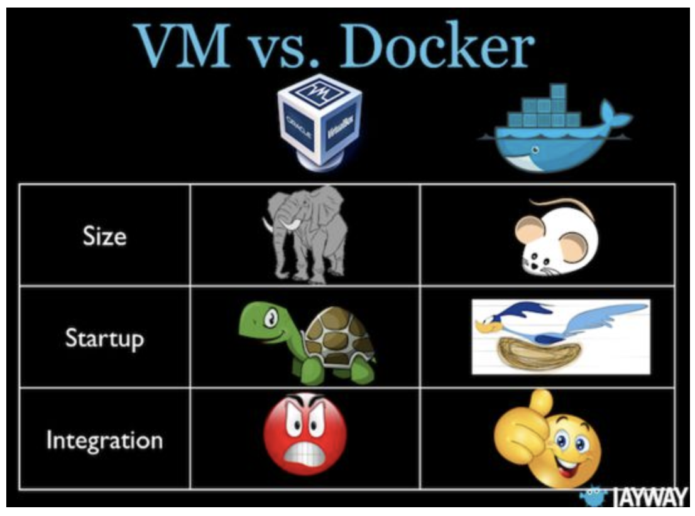
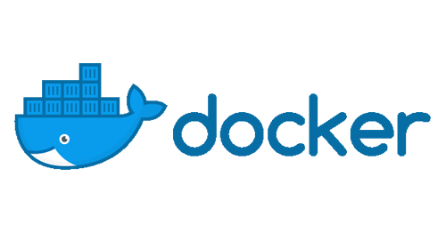

class: center, middle, first

<div class="first-page__header">
  
  <p class="first-page__caption">Software Engineering Services</p>
</div>

<div class="first-page__footer">
  
</div>

# Docker under microscope

---
layout: true

<div class="regular-page__background">
  
</div>

---
class: center

# A Story


---

# Agenda

1. What is Docker and How it Works?

---

# Agenda

1. What is Docker and How it Works?
2. Use Cases

---

# Agenda

1. What is Docker and How it Works?
2. Use Cases
3. Pros and Cons

---

# Agenda

<ol start="4">
  <li>Top 7 Tips and Tricks</li>
</ol>

---

# Agenda

<ol start="4">
  <li>Top 7 Tips and Tricks</li>
  <li>Best Practices</li>
</ol>

---

# Agenda


<ol start="4">
  <li>Top 7 Tips and Tricks</li>
  <li>Best Practices</li>
  <li>Docker Swarm or Kubernates?</li>
</ol>

---
class: center

# What is Docker?


---
class: center

# How it Works?


???

Explanation from official site:

Docker containers wrap up a piece of software in a complete filesystem
that contains everything it needs to run: code, runtime, system tools,
system libraries – anything you can install on a server.

This guarantees that it will always run the same,
regardless of the environment it is running in.

---
class: center

# Docker vs Virtual Machine


???

We will use comparison with VM. Who have ever ever used VMs? I mean
VirtualBox, Vagrant, VMWare, etc. etc. Sorry guys who never ever used it.
Maybe some things will be harder to understand.

One more official definition.

### General

Containers have similar resource isolation and allocation benefits
as virtual machines but a different architectural approach allows
them to be much more portable and efficient.

#### Virtual Machines

Each virtual machine includes the application, the necessary binaries
and libraries and an entire guest operating system -
all of which may be tens of GBs in size.

#### Containers

Containers include the application and all of its dependencies,
but share the kernel with other containers. They run as an isolated process
in userspace on the host operating system. They’re also not tied
to any specific infrastructure – Docker containers run on any computer,
on any infrastructure and in any cloud.

---
class: center

# The same but simplified



---

# Use Cases

---

# Use Cases

1. Simplifying Configuration

---

# Use Cases

1. Simplifying Configuration
2. App Isolation

---

# Use Cases

1. Simplifying Configuration
2. App Isolation
3. Rapid Deployment

---
class: center

# How do we use it




???

For development - all dependencies are Docker containers
For running tests in Elixir service

---
class: center

# Pros and Cons


---

# Pros

---

# Pros

* Multi-platform

---

# Pros

* Multi-platform
* Well documented

---

# Pros

* Multi-platform
* Well documented
* Public image register

---

# Cons

---

# Cons

* Performance issues on non-native envs

---

# Cons

* Performance issues on non-native envs
* Run applications with graphical interfaces

---

# Cons

* Performance issues on non-native envs
* Run applications with graphical interfaces
* Significant learning curve

---
class: center

# 7 Tips and Tricks


---

# Difference between CMD and ENTRYPOINT

```Dockerfile
CMD ["/bin/echo", "Hello world"]
ENTRYPOINT ["/bin/echo", "Hello world"]
```

???

- CMD sets default command and/or parameters, which can be
  overwritten from command line when docker container runs.
- ENTRYPOINT configures a container that will run as an executable.

### CMD

CMD instruction allows you to set a default command,
which will be executed only when you run container without
specifying a command. If Docker container runs with a command,
the default command will be ignored. If Dockerfile has more
than one CMD instruction, all but last CMD instructions are ignored.

CMD has three forms:

- `CMD ["executable","param1","param2"]` (exec form, preferred)
- `CMD ["param1","param2"]` (sets additional default parameters for ENTRYPOINT in exec form)
- `CMD command param1 param2` (shell form)

Again, the first and third forms were explained in Shell and Exec forms section.
The second one is used together with ENTRYPOINT instruction in exec form.
It sets default parameters that will be added after ENTRYPOINT parameters
if container runs without command line arguments. See ENTRYPOINT for example.

Let’s have a look how CMD instruction works. The following snippet in Dockerfile

http://goinbigdata.com/docker-run-vs-cmd-vs-entrypoint/

---

# CMD

```Dockerfile
CMD echo "Hello world" 
```

```sh
docker run -it <image>
# => Hello world
```

---

# CMD

```Dockerfile
CMD echo "Hello world" 
```

```sh
docker run -it <image> /bin/bash
# =>
root@7de4bed89922:/#
```

---

# ENTRYPOINT

```Dockerfile
ENTRYPOINT ["/bin/echo", "Hello"]
CMD ["world"]
```

```sh
docker run -it <image>
# => Hello world
```

---

# ENTRYPOINT

```Dockerfile
ENTRYPOINT ["/bin/echo", "Hello"]
CMD ["world"]
```

```sh
docker run -it <image> John
# => Hello John
```

---

# COPY vs ADD commands

```Dockerfile
# Within a Dockerfile

COPY script.sh /tmp
ADD script.sh /tmp
```

---

# COPY vs ADD commands

```Dockerfile
# 1 - Be able to automatically untar files
ADD scripts.tar.gz /tmp

# 2 - Fetching files from remote URLs
ADD http://www.example.com/script.sh /tmp
```

---

# How to Check if Container is Ready


???

wait-for-it.sh is a pure bash script that will wait on the availability
of a host and TCP port. It is useful for synchronizing the spin-up
of interdependent services, such as linked docker containers.
Since it is a pure bash script, it does not have any external dependencies.

---
class: smaller-code

# How to Check if Container is Ready

```docker-compose
version: "2"

services:
  web:
    build: .
    ports:
      - "80:8000"
    depends_on:
      - "db"
    command: ["./wait-for-it.sh", "db:5432", "--", "puma"]
  db:
    image: postgres
```

---

# Where is my space?

<div class="center">
  
</div>

---

# Cleanup commands

Remove all unused images:

```sh
docker image prune -a
```

Delete all stopped containers, dangling images, networks,
unused volumes and build cache at the same time:

```sh
docker system prune -a --volumes
```

---

# Use aliases

```sh
alias dr='docker rm $(docker ps -aq)'
alias ds='docker stop $(docker ps -aq)'
alias di='docker images'
alias dri='docker rmi $(docker images -q)'
alias dsr='ds && dr'
alias dps='docker ps -a'
alias dcup='docker-compose up'
```

---

# Manage env variables

Instead of doing things like this:

```sh
docker run -it \
  -e TEST=1234 \
  -e TEST1=3456 \
  -e TEST2=5678 \
  -e TEST3=7890 \
  --rm alpine /bin/ash
```

---

# Use env file

You can do it other way:

```sh
# env.file content

TEST=1234
TEST1=3456
TEST2=5678
TEST3=7890
```

---

# Much clearer, isn't it?

```sh
docker run -it \
  --env-file ./env.list \
  --rm alpine /bin/ash
```

---

# #docker

1. Download an IRC Client
2. Connect to the irc.freenode.net network
3. Join the #docker channel

???

I’m not talking about the hashtag!! I’m talking about the channel
on Freenode on IRC. It’s hands-down the best place to meet with
fellow Dockers online, ask questions (all levels welcome!), and
seek truly excellent expertise. At any given time there are about
1000 people or more sitting in, and it’s a great community as well
as resource. Seriously, if you’ve never tried it before, go check
it out. I know IRC can be scary if you’re not accustomed to using it,
but the effort of setting it up and learning to use it a bit will
pay huge dividends for you in terms of knowledge gleaned.
I guarantee it. So if you haven’t come to hang out with us
on IRC yet, do it!
